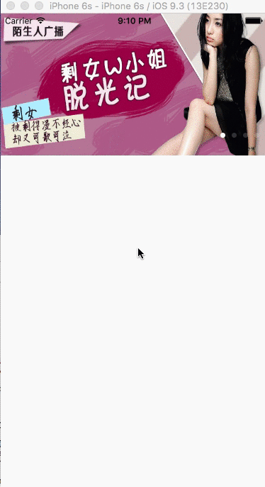

#TNScrollView
Do you wanna build UIScrollView like this in you apps?




##how to use

You can implement this with only 4 lines code, but you shoul import `TNScrollView.h` into you project.

```
//create a NSArray which includes the images' name
NSMutableArray *array = [[NSMutableArray alloc] initWithObjects:@"img_01",@"img_02", @"img_03", @"img_04", nil];
//create a TNScrollView with frame and scroll direction
TNScrollView *scrollview = [[TNScrollView alloc] initWithFrame:CGRectMake(0, 0, self.view.bounds.size.width, 200) andDirection: TNScrollViewDirectionHorizontal];
//set images in TNScrollView
[scrollview setImages:array];
//set timeInterval
[scrollview setTimeInterval:5];

//add scroll view to view's subviews
[self.view addSubview:scrollview];
```


##LICENCE
MIT